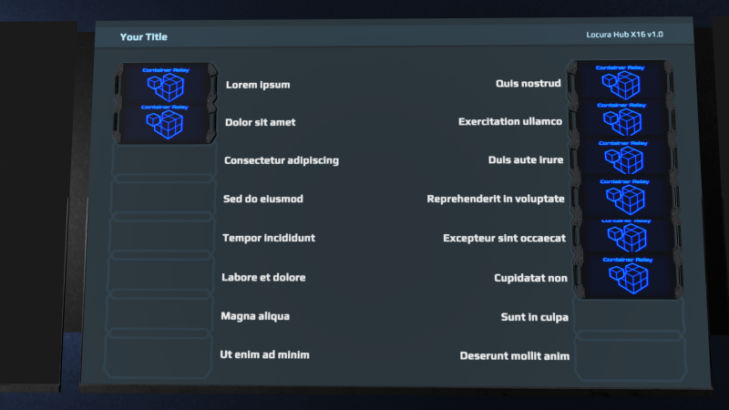
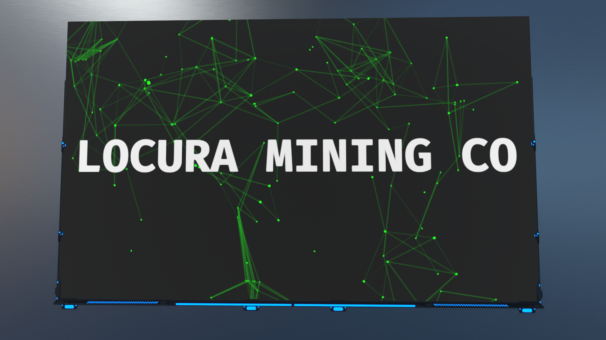
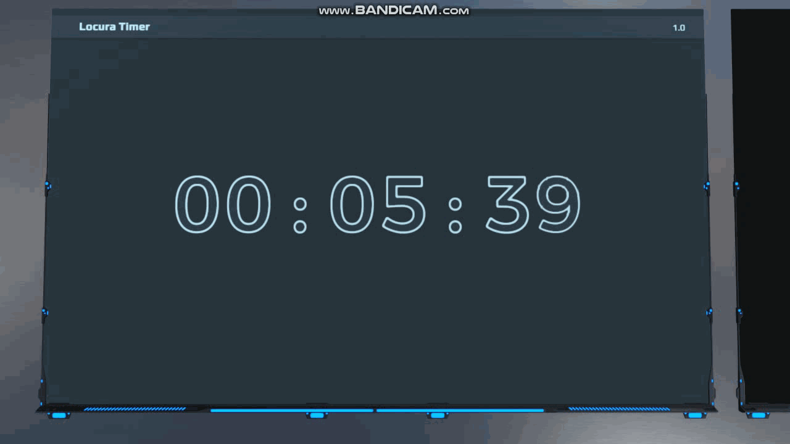
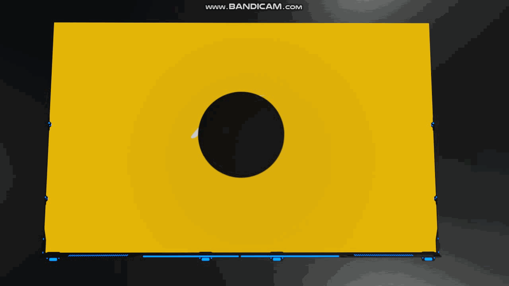

# Information
A collection of screen and sign codes for Dual Universe. 

---

# Lua Scripts

| Preview  | Name | Wiki |
| ------------- | ------------- | ------------- |
|  | LocuraHubX16 |  |
|  | NodesSign |  |
|  | VoronoiDiagram |  |
|  | WaveText |  |
|  | Timer |  |

# HTML Scripts

| Preview  | Name | Wiki |
| ------------- | ------------- | ------------- |
|  | Atom |  |
|  | Eclipse |  |
|  | Planet |  |
|  | Trees |  |

# Install LUA Code
- Paste contents of "SCRIPTNAME.lua" into following...
- Screen/Sign > Advanced > Edit Content > Mode - LUA

# Install HTML Code
:heavy_exclamation_mark: | HTML  on screens and signs is off by default. You will need to enter settings and enable them.
:---: | :---
- Paste contents of "SCRIPTNAME.html" into following...
- Screen/Sign > Advanced > Edit Content > Mode - HTML

# Screen And Sign Compatibility
:blue_square: Not Tested :green_square: Working :yellow_square: Partially Works Without Edits :red_square: Not Working Without Edits
> **Note**
> Please post in Discussions if you can confirm a screen or sign.
- :green_square: Screens
- :green_square: Modern Screens
- :green_square: Transparent Screens
- :green_square: Modern Transparent Screens
- :green_square: Signs
- :green_square: Vertical Signs

# Ways To Help
- Contribute new code, or updating whats already here
- Donate for Dr Pepper funds at Venmo @terranbytes
- Join or start a discussion on the discussions tab

# In Game
- CredenceH (Dual Universe)
- Locura (Dual Universe)
- NoobTheory (Dual Universe)

# Other
> **Note**
> Sources for some of the above codes come from all over. I have tried to note in the code where bits have come from but some I found in random places and have no clue who to credit. If you see somehting that should be added or fixed please let me know in the Discussions section.

> **Warning**
> This may or may not work with some screens or signs. Please check list above for compatibility.

> **Warning**
> Too many screen in an area will hurt game performance. The game will also start throttling back screen quality upon reaching a certain number of screens. Using Animations in screens will make this much worse. Only use a few animated screens in an area for best performance.
